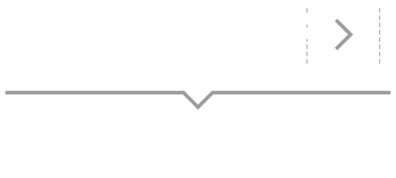

# Notes

To effectively manage note events, DryWetMIDI provides the [NotesManager](xref:Melanchall.DryWetMidi.Interaction.NotesManager) class to help with this. Instead of messing with Note On/Off events this manager allows to operate by [Note](xref:Melanchall.DryWetMidi.Interaction.Note) objects.

```csharp
using (var notesManager = new NotesManager(trackChunk.Events))
{
    NotesCollection notes = notesManager.Notes;

    var cSharpNotes = notes.Where(n => n.NoteName == NoteName.CSharp);
    notes.Add(new Note(NoteName.A, 4)
              {
                  Time = 123,
                  Length = 456,
                  Velocity = (SevenBitNumber)45
              });
}
```

Please read [general information about events managers](Events-managers-overview.md) prior to use `NotesManager`.

To get collection of all notes being managed by the current `NotesManager` you need to use [Notes](xref:Melanchall.DryWetMidi.Interaction.NotesManager.Notes) property which returns [NotesCollection](xref:Melanchall.DryWetMidi.Interaction.NotesCollection). `NotesCollection` has methods for adding and removing notes and also can be enumerated since it implements `IEnumerable<Note>`. In addition to these methods there are extension ones contained in [TimedObjectUtilities](xref:Melanchall.DryWetMidi.Interaction.TimedObjectUtilities) and [LengthedObjectUtilities](xref:Melanchall.DryWetMidi.Interaction.LengthedObjectUtilities). For example, you can get all notes in the first track chunk of a MIDI file that end at 20 seconds from the start of the file and get length of the first found note in _hours:minutes:seconds_ format:

```csharp
TempoMap tempoMap = midiFile.GetTempoMap();

using (var notesManager = midiFile.GetTrackChunks().First().ManageNotes())
{
    var notesEndedAt20Seconds = notesManager
        .Notes.EndAtTime(new MetricTimeSpan(0, 0, 20), tempoMap);

    var firstNoteLength = notesEndedAt20Seconds
        .First().LengthAs<MetricTimeSpan>(tempoMap);
}
```

Read the [time and length overview](Time-and-length-overview.md) to learn more about different time and length representations.

As you can see there is another way to get an instance of the `NotesManager` – through the `ManageNotes` extension method. This method and another useful ones are placed in [NotesManagingUtilities](xref:Melanchall.DryWetMidi.Interaction.NotesManagingUtilities). For example, to get all notes contained in a MIDI file you can write:

```csharp
IEnumerable<Note> notes = midiFile.GetNotes();
```

## Special utilities

There are several special utility methods that can be useful in real work with notes.

### ResizeNotes

`ResizeNotes` methods within [ResizeNotesUtilities](xref:Melanchall.DryWetMidi.Interaction.ResizeNotesUtilities) resizes group of notes to the specified length or by the specified ratio treating all notes as single object. `distanceCalculationType` defines the type (and therefore units) of distances calculations.

The following image shows the process in action:

